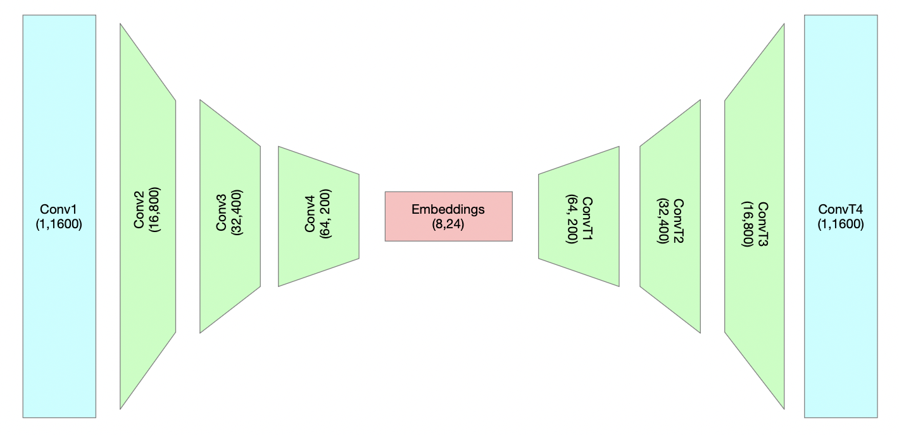

# New Document# Neural Data Compression for Audio

**Authors:**
- Michal Dokupil
- Elliott Vanwormhoudt

## Abstract

This report delves into the realm of audio data compression, with a specific focus on speech - a complex and vital form of audio data. It explores two distinct neural compression approaches: time-domain and frequency-domain processing. The time-domain method examines raw audio waveforms, while the frequency-domain approach, often involving transformations like the Fast Fourier Transform (FFT), focuses on spectral components. The crux of this study is the development and comparative analysis of two deep neural network models, each embodying one of these approaches, in the context of speech compression. The objective is not to outperform existing methods in terms of efficacy but rather to gain insights into the performance of each model with speech data and the implications of employing time-domain versus frequency-domain data in neural compression. This report outlines the development of these models, their architectural decisions, and the rationale behind them. It discusses the selection of speech datasets used for evaluation and the insights gained from comparing these two approaches. Through this study, we aim to contribute to the evolving field of advanced audio processing techniques, particularly in speech compression.

## Introduction

The advancement of neural compression techniques, primarily in image
processing, presents a compelling opportunity for exploring audio data
compression. This project focuses on speech, a complex and significant
form of audio data, and examines two different approaches to neural
compression: time-domain and frequency-domain processing. The
time-domain approach analyzes the raw audio waveform, while the
frequency-domain approach, often involving transformations like the Fast
Fourier Transform (FFT), deals with the spectral components.

The core of this study is to design and compare two deep neural network
models, one for each approach, in the context of speech compression. The
aim is not to surpass existing methods in performance but to understand
how each model performs with speech data and the implications of using
time-domain versus frequency-domain data in neural compression.

This report will outline the development of these models, their
architectural choices, and the rationale behind them. It will also
discuss the selection of speech datasets used for evaluation and the
insights gained from comparing these two approaches. Through this study,
we aim to contribute to the ongoing exploration of advanced audio
processing techniques, particularly in the realm of speech.

## Traditional algorithms for audio compression

In the realm of audio compression, two algorithms that have
significantly impacted the field are **MP3** and **Opus**. These
algorithms highlight the evolution and diverse methodologies in
traditional audio compression.

### MPEG Layer III (MP3)

Developed by the Fraunhofer Society, MP3 revolutionized the digital
music industry, becoming synonymous with audio compression in the
digital age. It employs lossy compression, using perceptual coding to
reduce file sizes by removing audio frequencies less perceptible to
human ears. While MP3 became dominant in the consumer market,
particularly for music files, its limitations are evident, especially at
lower bitrates where quality loss is noticeable. Compared to newer
codecs like AAC and Opus, MP3 is less efficient [1](#1).

### Opus

Opus, developed by the Internet Engineering Task Force (IETF), is
designed for interactive speech and music transmission over the
Internet. As a hybrid codec combining SILK (used in Skype) and CELT,
Opus dynamically adapts to various audio characteristics, making it
versatile for different applications. It is widely used in VoIP, video
conferencing, and streaming applications, renowned for its low latency
which is ideal for real-time interactions. Opus offers better sound
quality at given bitrates compared to MP3 and most other audio codecs,
being adaptable for both music and speech, and efficiently handles a
wide range of bitrates and network conditions [2](#2).

The contrast between MP3 and Opus is striking. While MP3 marked the
beginning of digital audio compression, Opus represents the modern
advancements in the field, offering greater flexibility and efficiency,
especially for internet-based applications. This evolution from MP3's
perceptual coding approach to Opus's low-latency, adaptable design
highlights the changing landscape of audio compression technologies.

## Model

The encoder-decoder architecture is a fundamental framework in deep
learning, particularly in tasks involving the transformation of input
data into a compressed representation and subsequently reconstructing it
back to its original form or a version of it. This architecture is
widely used in applications like image and audio processing, machine
translation, and more.

the encoder-decoder architecture comprises two main components: the
encoder and the decoder. The encoder processes the input data and
compresses it into a lower-dimensional representation, often called a
latent space or an embedding. This representation captures the essential
features of the input data. The decoder then takes this compressed
representation and reconstructs the original data or an approximation of
it. The effectiveness of this architecture lies in its ability to learn
compressed representations that retain the critical information of the
input data.

### Encoder-decoder for time data

  
*Figure: Architectural Overview of the Model*

### Mathematical Formulation of Convolutional Layer Dimensions

A critical aspect of understanding the behavior of convolutional layers
in our audio compression autoencoder involves formulating the
relationship between various parameters of the convolutional layers and
their output dimensions. The dimensions of the output feature map are a
function of the input size, kernel size, stride, and padding, as defined
by the following equation:
$$\text{Output Size} = \left\lfloor \frac{\text{Input Size} - \text{Kernel Size} + 2 \times \text{Padding}}{\text{Stride}} \right\rfloor + 1$$
Where:

-   Input Size refers to the dimension (height or width) of the input
    feature map.

-   Kernel Size is the size of the filter applied in the convolutional
    layer.

-   Stride denotes the step size with which the filter moves across the
    input feature map.

-   Padding represents the number of pixels added to the periphery of
    the input feature map.

This formula is pivotal for calculating the size of the output feature
map resulting from a convolutional operation. It allows for the precise
design of each layer in the network, ensuring that the output dimensions
align with the model's requirements.

#### Encoder

The encoder of our model is designed to process 100ms clips of audio
data. It consists of four convolutional layers, each serving to extract
and compress features from the input audio signal.

-   Layer 1 (Conv1): This layer has 16 filters with a kernel size of 3,
    a stride of 2, and padding of 1. It reduces the dimensionality of
    the input while capturing basic audio features.

-   Layer 2 (Conv2): With 32 filters, this layer further compresses the
    data, extracting more complex features.

-   Layer 3 (Conv3): Continuing the trend, this layer, with 64 filters,
    deepens the feature extraction.

-   Layer 4 (Embedding): The final layer of the encoder, this
    convolution layer transforms the input into a 4,8 or 16-channel
    embedding, representing the most compressed form of the input data.
    The number of channels allows us to impact the compression ratio,
    from 4x for 16-channels to 16x for 4-channels.

#### Decoder

The decoder's role is to reconstruct the original audio from the
compressed embedding. It mirrors the encoder structure but uses
transposed convolutions to expand the data back to its original
dimension.

-   Layer 1 (Deconv1): Starting from the 4,8 or 16-channel embedding,
    this layer uses transposed convolution to expand the feature map.

-   Layer 2 (Deconv2): Further reconstruction is performed with 64
    filters, increasing the data dimensionality.

-   Layer 3 (Deconv3): This layer, with 32 filters, continues to
    reconstruct the audio signal.

-   Layer 4 (Deconv4): The final layer, with 16 filters, nearly restores
    the audio to its original form. It outputs a single channel,
    signifying the reconstruction of the original audio signal.

#### Loss function

To optimize the performance of our audio compression autoencoder,
various loss functions were employed and analyzed. The primary goal of
these functions is to quantify the difference between the original audio
input $x$ and the reconstructed audio output $\hat{x}$. This section
outlines the loss functions tried in our model.

##### Reconstruction Loss

Reconstruction loss, typically the first component of an autoencoder's
loss function, measures the fidelity of the reconstructed audio. We
implemented the L1 norm, also known as Mean Absolute Error (MAE),
defined as:

$$\ell(x, \hat{x}) = \| x - \hat{x} \|_1$$

This loss function computes the average absolute difference between the
original and reconstructed signals over the time domain, promoting
sparsity in the representation.

##### Mean Squared Error (MSE)

MSE is a common loss function that measures the average squared
difference between the original and reconstructed values. It is
formulated as:

$$MSE(x, \hat{x}) = \frac{1}{N} \sum_{i=1}^{N} (x_i - \hat{x}_i)^2$$

MSE is sensitive to outliers and often used in regression problems. In
the context of audio, it ensures the preservation of the overall
waveform structure [3](#3).

##### Root Mean Squared Error (RMSE)

The RMSE enhances the MSE by calculating the square root of the mean
squared error, thus providing a loss metric in the same units as the
audio signal:

$$RMSE(x, \hat{x}) = \sqrt{\frac{1}{N} \sum_{i=1}^{N} (x_i - \hat{x}_i)^2}$$

RMSE is particularly useful for understanding the magnitude of
reconstruction error.

##### Frequency Domain Loss

Beyond time-domain losses, our model incorporates a frequency domain
loss to capture the perceptual aspects of audio quality. The frequency
domain loss $\ell_f$ is a hybrid of L1 and L2 norms over the
mel-spectrogram [4](#4)[5](#5), providing a balance
between the fidelity of reconstruction and the perceptual quality:

$$
\ell_f(x, \hat{x}) = \frac{1}{|\alpha| \cdot |s|} \sum_{\alpha_i \in \alpha} \sum_{i \in \epsilon} \left( \|\mathbf{S}_i(x) - \mathbf{S}_i(\hat{x})\|_1 + \alpha_i \|\mathbf{S}_i(x) - \mathbf{S}_i(\hat{x})\|_2 \right)
$$

where $\mathbf{S}_i$ is a 64-bins mel-spectrogram using a normalized
Short-Time Fourier Transform (STFT) with varying window and hop sizes,
$\alpha$ is a set of scalar coefficients for balancing the L1 and L2
terms, and $\epsilon$ is the set of scales.

These loss functions serve as critical tools for training our model,
guiding the optimization process to achieve a balance between accurate
reconstruction and perceptual quality. The selection and tuning of these
loss components are central to the autoencoder's performance,
influencing the quality and efficiency of the audio compression.

### Encoder-decoder for audio spectrograms

Autoencoders are commonly used to process images. In the second
experiment, we tried to implement simple encoder-decoder neural network
that processes 2D (sprectrograms). Spectrograms represent a visual form
of the frequencies present in audio signals over time. The potential
benefit of employing spectrogram it the robustness towards noise which
might be useful in denoising problems. However, the drawback of this
method is the inevitable general information loss during conversion.

#### Data Preprocessing

Before feeding the audio data into the network, we convert the raw
waveform into spectrograms using the Short-Time Fourier Transform
(STFT). The audio data is transformed into spectrograms corresponding to
1 second of audio data, consisting of 201 frequency bins, resulting in
dimensionality (1, 201, 81).

### Model Architecture

#### Encoder

-   **Layer 1 (Conv1):** This layer has 8 filters with a kernel size of
    3, a stride of 2, and padding of 1. It reduces the dimensionality of
    the input while capturing basic audio features.

-   **Layer 2 (Conv2):** With 32 filters, this layer further compresses
    the data, extracting more complex features.

-   **Layer 4 (Embedding):** Last layer of encoder transforms the data
    into 16 channel embedding of shape (16, 17, 7) which results in a
    compression factor of $\frac{16281}{1904} \approx 8.5$

#### Decoder

The decoder's role is to reconstruct the original audio from the
compressed embedding. It mirrors the encoder structure but uses
transposed convolutions to expand the data back to its original
dimension.

-   **Layer 1 (Deconv1):** Initiates the reconstruction process using a
    transposed convolutional layer with 32 output channels, a kernel
    size of 3, a stride of 2, and padding of 1.

-   **Layer 2 (Deconv2):** Further reconstruction is carried out using a
    transposed convolutional layer with 8 output channels, a kernel size
    of 3, a stride of 2, and padding of 1.

-   **Layer 3 (Output Layer):** The final layer employs a transposed
    convolutional layer with 1 output channel, a kernel size of 3, a
    stride of 2, and padding of 1. This layer transforms data into the
    original dimensionality, resulting in reconstructed representation
    of the spectrogram.

#### Loss Function

For the training of this model, the MSE loss function (same as in the
time-domain model) was applied. However, the computations are performed
on spectrogram representations rather than raw audio waveforms.

## Results

For our evaluation, we utilized the MS-SNSD datasets
[6](#6), providing us with over 100 hours of clean speech
data. This extensive collection not only facilitated the analysis of
denoising capabilities on artificially noisified speech but also ensured
a robust testing framework. It also allowed to see if adding noise to
the audio during training yielded to better results. Additionally, we
incorporated the LibriSpeech dataset [7](#7) to assess the model's
generalization to unseen data, gauging its performance on diverse speech
inputs not encountered during training.

To further extend our model's evaluation to non-speech domains, we
employed a dataset of music [8](#8) and birds sounds [9](#9).
Due to the inherent differences in data composition, this step was
crucial to investigate the model's adaptability to a broader range of
audio types. The music dataset underwent a resampling process, first
downsampled to 16kHz to align with our model's input specifications and
subsequently resampled back to 24kHz to evaluate the model's
reconstruction fidelity. This comprehensive approach to testing provided
us with a nuanced understanding of the model's capabilities across
various audio contexts.

### Metrics

For analyzing our results, we used 4 different metrics :

-   **PESQ Score (Perceptual Evaluation of Speech Quality)**[10](#10): A
    standard metric for assessing audio quality in telecommunications.
    It compares the original and processed audio signals, with higher
    scores (ranging from -0.5 to 4.5) indicating better perceived audio
    quality.

-   **L1 Loss (Mean Absolute Error)**: Represents the average magnitude
    of errors between pairs of observations. It measures the average
    absolute difference between actual and predicted values, with lower
    values indicating better accuracy.

-   **SNR Loss (Signal-to-Noise Ratio Loss)**[11](#11): A
    measure used to compare the level of a desired signal to the level
    of background noise. Lower values indicate a clearer signal with
    less noise.

-   **Si-SDR Loss (Scale-Invariant Signal-to-Distortion Ratio
    Loss)**[12](#12): An advanced metric for audio quality assessment,
    particularly in source separation tasks. It measures the ratio of
    the desired signal power to the distortion power. Lower values (more
    negative) indicate minimal distortion and better signal integrity. .

### Loss functions tests

| Loss Function                   | PESQ Score | L1 Loss | SNR Loss | SISDR Loss |
|---------------------------------| ---------- | ------- | -------- | ---------- |
| L1 + L2                         | 1.388      | 0.012   | -7.617   | -6.859     |
| L1 & L2 over mel-spectrogram    | 1.532      | 0.016   | -5.229   | -3.681     |
| MSE                             | 1.402      | 0.013   | -7.871   | -7.370     |
| L1                              | 1.381      | 0.015   | -6.833   | -6.282     |
| RMSE                            |1.342       | 0.013   | -7.611   | -6.830     |

### A|nalysis {#analysis .unnumbered}

-   **PESQ Score**: The *Linear combination* method achieved the highest
    score (1.532), indicating superior perceived audio quality for the
    speech.

-   **L1 Loss**: The *L1 + L2* method recorded the lowest L1 loss
    (0.012), demonstrating its effectiveness in minimizing absolute
    error.

-   **SNR Loss**: The *L1 + L2* method showed the least negative SNR
    loss , suggesting better signal-to-noise ratio.

-   **SISDR Loss**: The *L1 + L2* method excelled with the highest
    (least negative) SISDR loss , indicating its efficacy in maintaining
    signal-to-distortion ratio.

Overall, the *L1 + L2* loss function appears most effective across
multiple metrics, particularly excelling in L1 score, SNR, and SISDR
losses, which signifies its efficiency in audio compression while
retaining quality.

However, if we focus only in the capacity of understanding the speech,
then the linear combination of L1 & L2 over the mel-spectrogram performs
the best, even-though it add a sort of robotic effect on the
reconstructed voice.

### Adaption to different audio types

| Audio genre  | PESQ Score | RMSE loss | SNR Loss | SISDR Loss |
| ------------ | ---------- | --------- | -------- | ---------- |
| human speech | 1.363      | 0.003     | -8.124   | -7.920     |
| birds sounds | ?          | 0.008     | 3.917    | 64.760     |
| rock music   | 1.512      | 0.011     | -2.989   | -3.030     |

| Audio genre  | PESQ Score | RMSE loss | SNR Loss | SISDR Loss |
| ------------ | ---------- | --------- | -------- | ---------- |
| human speech | 1.758      | 0.006     | -6.158   | -4.982     |
| birds sounds | ?          | 0.005     | 10.616   | 33.499     |
| rock music   | 1.562      | 0.011     | -2.989   | -3.030     |

The models trained on both L1 loss and L1 & L2 over mel-spectrogram loss
achieved relatively good performance in reconstructing human speech.
However, for bird sounds, the models struggled to provide intelligible
result. In contrast, the reconstruction of rock music resulted in
acceptable quality of audio but not as clear as human speech. Model
trained using L1 loss obtained more pleasant-to-listen sounds when
reconstructing music, than the latter model.

### Comparison with traditional algorithms

| Compression Ratio | PESQ    | SNR       | Si-SDR   | L1       |
| ----------------- | ------- | --------- | -------- | -------- |
| 16x               | 1.2489  | -7.4830   | -7.8126  | 0.01493  |
| 8x                | 1.5097  | -9.4078   | -9.2285  | 0.008121 |
| 4x                | 1.9637  | -12.5124  | -11.7998 | 0.006058 |
| 2x                | 1.9687  | -14.0368  | -14.36356| 0.003702 |
| MP3(8x)           | 1.47055 | -9.6542   | -9.2709  | 0.0095863|
| MP3(4x)           | 2.3793  | -14.32176 | -14.3313 | 0.004816 |
| OPUS(8x)          | 2.4420  | -13.9004  | -14.3541 | 0.0050345|
| OPUS(4x)          | 4.3020  | -30.3895  | -29.9285 | 0.0007973|

**Comparison with MP3 and OPUS:** At 8x and 4x compression levels, our
model's PESQ scores are competitive with MP3 and lower than OPUS.
However, in terms of SNR and Si-SDR, OPUS outperforms our model. In the
L1 norm metric, our model shows competitive or better performance.

#### Spectrogram-based model

The subjective assessments of reconstructed audio files were not meeting
our expectations and showed significant shortcomings compared to the
previous model. We assume that the information loss in preprocessing
(conversion to spectrogram) was too high and we were not able to achieve
better results after modifying the transformation parameters. Due to
this fact, we did not explore this model further as were not able to
improve it's quality more. The evaluation score on an arbitrary sample
of human speech are shown in the following table:\

| PESQ score | RMSE loss | SNR loss | SISDR loss |
| ---------- | --------- | -------- | ---------- |
| 1.039      | 0.016     | 7.076    | 40.799     |

### Noise

In our final set of experiments, we introduced noise into the audio
input of our model. The rationale behind this approach was to evaluate
whether the presence of noise could enhance the model's robustness and
performance. Contrary to our expectations, the introduction of noise
resulted in a noticeable deterioration of audio quality. This was
quantitatively reflected in a 10% reduction in the Perceptual Evaluation
of Speech Quality (PESQ) score. Given these unfavorable outcomes, we
decided not to pursue further experimentation along this line. This
finding underscores the sensitivity of our model to noise interference,
suggesting a potential area for future refinement.

## Conclusion

In this project, we explored neural data compression techniques for
audio, focusing particularly on speech. Our investigation involved the
development and analysis of two, relatively small, neural network
models: the time-domain model and the model processing audio
spectrograms.

The evaluation of designed and trained model has shown that the
time-domain model on raw audio waveforms achieved promising results in
compressing speech data. The model was able to preserving perceptual
quality, achieving competitive performance metrics such as PESQ scores
and L1 losses comparable to traditional codecs like MP3 at certain
compression ratios. However, the OPUS codec noticeably surpassed our
models.

Despite promising results in speech compression, especially in the
time-domain approach, there remain challenges in achieving a broader
adaptability to diverse audio types. While the music data was restored
in listenable quality, the model was not able to reconstruct properly
softer and delicate sounds such as bird's chirping.

Future research directions may involve further experimenting with the
model architecture, optimizing the loss functions, and explore ways to
enhance the adaptability of neural audio compression.

## References
<a id="1">[1]</a> Yamamoto, R., Song, E., Kim, J-M. (2020). Parallel WaveGAN: A Fast Waveform Generation Model Based on Generative Adversarial Networks with Multi-Resolution Spectrogram. ICASSP 2020 - 2020 IEEE International Conference on Acoustics, Speech and Signal Processing (ICASSP), 6199-6203. DOI: [10.1109/ICASSP40776.2020.9053795](https://doi.org/10.1109/ICASSP40776.2020.9053795).

<a id="2">[2]</a> Gritsenko, A. A., Salimans, T., van den Berg, R., Snoek, J., Kalchbrenner, N. (2020). A Spectral Energy Distance for Parallel Speech Synthesis. URL: [https://arxiv.org/abs/2008.01160](https://arxiv.org/abs/2008.01160).

<a id="3">[3]</a> Reddy, C. K. A., Beyrami, E., Pool, J., Cutler, R., Srinivasan, S., Gehrke, J. (2019). A Scalable Noisy Speech Dataset and Online Subjective Test Framework. Proc. Interspeech 2019, 1816-1820.

<a id="4">[4]</a> Kolbæk, M., Tan, Z-H., Jensen, S. H., Jensen, J. (2020). On Loss Functions for Supervised Monaural Time-Domain Speech Enhancement. IEEE/ACM Transactions on Audio, Speech, and Language Processing, 28, 825-838. DOI: [10.1109/TASLP.2020.2968738](https://doi.org/10.1109/TASLP.2020.2968738).

<a id="5">[5]</a> Rix, A. W., Beerends, J. G., Hollier, M. P., Hekstra, A. P. (2001). Perceptual Evaluation of Speech Quality (PESQ)-A New Method for Speech Quality Assessment of Telephone Networks and Codecs. 2001 IEEE International Conference on Acoustics, Speech, and Signal Processing. Proceedings (cat. no.01CH37221), 749-752 vol.2. DOI: [10.1109/ICASSP.2001.941023](https://doi.org/10.1109/ICASSP.2001.941023).

<a id="6">[6]</a> Yuan, T., Deng, W., Tang, J., Tang, Y., Chen, B. (2019). Signal-to-Noise Ratio: A Robust Distance Metric for Deep Metric Learning. URL: [https://arxiv.org/abs/1904.02616](https://arxiv.org/abs/1904.02616).

<a id="7">[7]</a> Valin, J-M., Vos, K., Terriberry, T. (2012). RFC 6716: Definition of the Opus Audio Codec. RFC Editor.

<a id="8">[8]</a> Brandenburg, K. (1999). MP3 and AAC Explained. Audio Engineering Society Conference: 17th International Conference: High-Quality Audio Coding.

<a id="9">[9]</a> ProbabilityCourse.com. (2020). Mean Squared Error (MSE). URL: [http://www.probabilitycourse.com](http://www.probabilitycourse.com).

<a id="10">[10]</a> Huggingface. MLNSIO Audio Datasets. URL: [https://huggingface.co/datasets/mlnsio/audio](https://huggingface.co/datasets/mlnsio/audio).

<a id="11">[11]</a> Kaggle. Multilabel Bird Species Classification - NIPS 2013. URL: [https://www.kaggle.com/c/multilabel-bird-species-classification-nips2013/data](https://www.kaggle.com/c/multilabel-bird-species-classification-nips2013/data).

<a id="12">[12]</a> OpenSLR. Speech and Language Resources. URL: [https://www.openslr.org/12](https://www.openslr.org/12).
